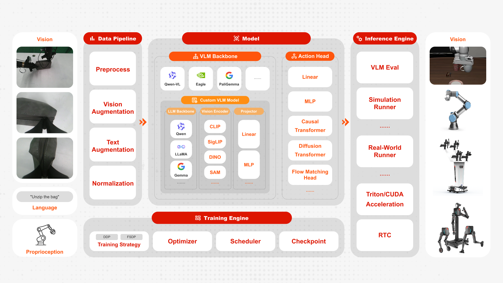
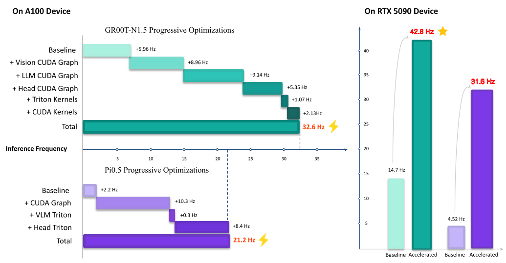

# FluxVLA Engine: A One-Stop VLA Engineering Platform for Embodied Intelligence

<p align="center">
  
</p>

<div align="center">
<a href="https://huggingface.co/limxdynamics/FluxVLAEngine"></a>
<a href="https://fluxvla.limxdynamics.com"></a>
<a href="https://fluxvla.limxdynamics.com/zh/"></a>
<a href="https://github.com/limxdynamics/FluxVLA/issues/1"></a>
<a href="https://github.com/limxdynamics/FluxVLA/issues/1"></a>
</div>

<div align="center">

English | [简体中文](README_zh-CN.md) | [日本語](README_ja.md)

</div>

FluxVLA Engine is a full-stack, end-to-end engineering platform for deploying embodied intelligence applications. Built on the core design principles of unified configuration, standardized interfaces, module decoupling, and deployability, it creates a complete engineering loop from data to real-device deployment. With the goal of providing a standardized industry–academia–research foundation, it significantly lowers the engineering barrier for VLA research and development.

## Framework

<p align="center">
  
</p>

## Performance

| Codebase                    |                                                     Libero-Spatial                                                      |                                                      Libero-Object                                                      |                                                      Libero-Goal                                                      |                                                     Libero-Long                                                     |                                             Libero-Average                                             |
| --------------------------- | :---------------------------------------------------------------------------------------------------------------------: | :---------------------------------------------------------------------------------------------------------------------: | :-------------------------------------------------------------------------------------------------------------------: | :-----------------------------------------------------------------------------------------------------------------: | :----------------------------------------------------------------------------------------------------: |
| FluxVLA(SmolVLA)            |      [86.2](https://huggingface.co/limxdynamics/FluxVLAEngine/tree/main/smolvla_libero_spatial_full_finetune_bs64)      |      [92.4](https://huggingface.co/limxdynamics/FluxVLAEngine/tree/main/smolvla_libero_object_full_finetune_bs64)       |      [91.4](https://huggingface.co/limxdynamics/FluxVLAEngine/tree/main/smolvla_libero_goal_full_finetune_bs64)       |      [68.8](https://huggingface.co/limxdynamics/FluxVLAEngine/tree/main/smolvla_libero_10_full_finetune_bs64)       |                                                  84.7                                                  |
| FluxVLA(GR00T)              |  [97.4](https://huggingface.co/limxdynamics/FluxVLAEngine/tree/main/gr00t_eagle_3b_libero_spatial_full_finetune_bs64)   |   [96.2](https://huggingface.co/limxdynamics/FluxVLAEngine/tree/main/gr00t_eagle_3b_libero_object_full_finetune_bs64)   |   [94.6](https://huggingface.co/limxdynamics/FluxVLAEngine/tree/main/gr00t_eagle_3b_libero_goal_full_finetune_bs64)   | [93.0±1.5](https://huggingface.co/limxdynamics/FluxVLAEngine/tree/main/gr00t_eagle_3b_libero_10_full_finetune_bs64) |                                                  95.3                                                  |
| FluxVLA(Qwen3VL 0.6B+GR00T) | [96.0](https://huggingface.co/limxdynamics/FluxVLAEngine/tree/main/gr00t_qwen3vl_0.6b_libero_object_full_finetune_bs64) | [99.4](https://huggingface.co/limxdynamics/FluxVLAEngine/tree/main/gr00t_qwen3vl_0.6b_libero_object_full_finetune_bs64) | [95.2](https://huggingface.co/limxdynamics/FluxVLAEngine/tree/main/gr00t_qwen3vl_0.6b_libero_goal_full_finetune_bs64) | [94.2](https://huggingface.co/limxdynamics/FluxVLAEngine/tree/main/gr00t_qwen3vl_0.6b_libero_10_full_finetune_bs64) |                                                 96.20                                                  |
| FluxVLA(DreamZero)          | [98.2](https://huggingface.co/limxdynamics/FluxVLAEngine/tree/main/dreamzero_libero_spatial_full_finetune_w_cache_bs64) | [98.8](https://huggingface.co/limxdynamics/FluxVLAEngine/tree/main/dreamzero_libero_object_full_finetune_w_cache_bs64)  | [93.2](https://huggingface.co/limxdynamics/FluxVLAEngine/tree/main/dreamzero_libero_goal_full_finetune_w_cache_bs64)  | [94.8](https://huggingface.co/limxdynamics/FluxVLAEngine/tree/main/dreamzero_libero_10_full_finetune_w_cache_bs64)  |                                                 96.25                                                  |
| FluxVLA(PI0)                |   [98.6](https://huggingface.co/limxdynamics/FluxVLAEngine/tree/main/pi0_paligemma_libero_spatial_full_finetune_bs64)   |   [98.8](https://huggingface.co/limxdynamics/FluxVLAEngine/tree/main/pi0_paligemma_libero_object_full_finetune_bs64)    |   [96.8](https://huggingface.co/limxdynamics/FluxVLAEngine/tree/main/pi0_paligemma_libero_goal_full_finetune_bs64)    |   [93.2](https://huggingface.co/limxdynamics/FluxVLAEngine/tree/main/pi0_paligemma_libero_10_full_finetune_bs64)    |                                                 96.85                                                  |
| FluxVLA(FastWAM)            |                                                          97.3                                                           |                                                          99.8                                                           |                                                         97.4                                                          |                                                        94.6                                                         | [97.26](https://huggingface.co/limxdynamics/FluxVLAEngine/tree/main/fastwam_libero_full_finetune_bs16) |
| FluxVLA(PI0.5)              |  [98.6](https://huggingface.co/limxdynamics/FluxVLAEngine/tree/main/pi05_paligemma_libero_spatial_full_finetune_bs64)   |   [99.6](https://huggingface.co/limxdynamics/FluxVLAEngine/tree/main/pi05_paligemma_libero_object_full_finetune_bs64)   |   [98.0](https://huggingface.co/limxdynamics/FluxVLAEngine/tree/main/pi05_paligemma_libero_goal_full_finetune_bs64)   | [95.6±1.0](https://huggingface.co/limxdynamics/FluxVLAEngine/tree/main/pi05_paligemma_libero_10_full_finetune_bs64) |                                                 97.95                                                  |

*Linked scores point to the corresponding checkpoints.*

#### RoboCasa GR1

| Model          | Training Data      | Cabinet | Drawer | Microwave | Generalization | Average                                                                                                                        |
| -------------- | ------------------ | ------- | ------ | --------- | -------------- | ------------------------------------------------------------------------------------------------------------------------------ |
| FluxVLA(GR00T) | 24 tasks, 30 demos | 22.7%   | 35.7%  | 32.5%     | 48.9%          | [44.3%(50trials)](https://huggingface.co/limxdynamics/FluxVLAEngine/tree/main/gr00t_eagle_3b_robocasa_gr1_24x30_finetune_bs64) |

#### Notes

- `Cabinet`: `PnPBottleToCabinetClose` + `PnPWineToCabinetClose`.
- `Drawer`: `PnPCanToDrawerClose` + `PnPCupToDrawerClose`.
- `Microwave`: `PnPMilkToMicrowaveClose` + `PnPPotatoToMicrowaveClose`.
- `Generalization`: the remaining 18 post-train novel tasks.
- The RoboCasa GR00T result is evaluated with 50 trials per task.

## 📢 Latest News

**\[2026/08/13\]** 🔥 FastWAM world-action model support is now available.

**\[2026/08/10\]** 🔥 FluxVLA deployment on NVIDIA Jetson Orin is now supported, with edge inference acceleration reaching 7.4 Hz for GR00T-N1.5. See [orin_flashing.md](docs/orin_flashing.md) for initial flashing and [orin_docker_runtime.md](docs/orin_docker_runtime.md) to start the FluxVLA Docker setup.

**\[2026/06/30\]** 🔥 Single-arm and dual-arm Franka real-robot inference is now supported, including joint/eepose control configs and a deployment guide. See [docs/franka.md](docs/franka.md).

**\[2026/06/25\]** 🔥 GR00T-RTC-accelerated inference is now supported, achieving 45 Hz on an RTX 5090.

**\[2026/06/22\]** 🔥 A minimal Oli humanoid whole-body (loco-manipulation) real-robot inference path (operator + runner + example config) is now available. See [docs/oli_whole_body.md](docs/oli_whole_body.md).

**\[2026/06/17\]** 🔥 ARM reward modeling with RA-BC/AW-BC reweighting is now supported. See [docs/arm.md](docs/arm.md) for setup and usage.

**\[2026/06/10\]** 🔥 RoboCasa GR1 simulation tasks with GR00T are now supported.

**\[2026/06/04\]** 🔥 Triton backend for Pi0.5-RTC is now supported, see [inference_acceleration](docs/inference_acceleration.md).

**\[2026/05/28\]** 🔥 [FluxDAgger](https://github.com/FluxVLA/FluxDAgger) is now released: a model-decoupled DAgger pipeline for dual-arm manipulation, making it easy to integrate different VLAs and reward models.

**\[2026/05/28\]** 🔥 The embodied manipulation simulation benchmark [FluxBisim](https://github.com/FluxVLA/FluxBisim) is now released.

**\[2026/05/09\]** 🔥 SmolVLA is now supported.

**\[2026/04/24\]** 🔥 Pi0.5-RTC is now supported.

**\[2026/04/22\]** 🔥 ZMQ-based remote inference framework is now supported.

**\[2026/04/15\]** 🔥 DreamZero WAM is now supported.

**\[2026/04/08\]** 🔥 FluxVLA has been open-sourced.

## 🛠️ Installation

Choose one of the following installation paths:

- **Recommended one-command installer**: use this for normal training,
  simulation evaluation, and real-robot inference setups.
- **Update an existing FluxVLA environment**: use this if you installed an
  earlier FluxVLA release and only need to refresh changed packages.
- **Manual installation from scratch**: use this only when you need to control
  every package install step yourself.

### Recommended: one-command installer

```bash
conda create -n fluxvla python=3.10 -y
conda activate fluxvla

# Choose one mode: sim-only, real-only, or full.
bash scripts/install_env.sh sim-only
# bash scripts/install_env.sh real-only
# bash scripts/install_env.sh full
```

<details>
<summary><b>If the installer has issues: check modes and CUDA profile selection</b></summary>

`sim-only` installs simulation / LIBERO / RoboCasa runtime dependencies plus
the pinned RoboCasa source checkouts under `./src`, `real-only` installs
real-robot and remote-inference dependencies, and `full` installs both. Pass
`--skip-robocasa` if you do not need the RoboCasa checkouts.
RoboCasa simulator assets are downloaded by default whenever the installer
installs the RoboCasa source checkouts (`sim-only`, `full`, or `real-only --with-robocasa`). The installer calls `scripts/download_robocasa_assets.py`
and uses `FLUXVLA_ROBOCASA_ASSET_ENDPOINT` (default: `HF_ENDPOINT`, then
`https://hf-mirror.com`). Use `--skip-robocasa-assets` to skip only the assets,
or `--skip-robocasa` to skip both the source checkouts and the assets.

The installer selects a CUDA PyTorch profile automatically from the current
CUDA toolkit / `nvcc` version first: CUDA >= 12.8 selects `cu128`, otherwise it
selects `cu124`. If no toolkit is visible, it falls back to driver-reported
CUDA and then GPU generation. Override it with `--profile cu128` or
`--profile cu124`.

After PyTorch is installed, the FlashAttention wheel is selected from the
actual Python tag, PyTorch version, CUDA major version, C++ ABI, and CPU
architecture. If your platform has no matching prebuilt wheel, set
`FLASH_ATTN_WHEEL_URL` explicitly or pass `--skip-flash-attn`.

`av` is installed from the pip wheel first by default to avoid slow conda
dependency resolution; if no wheel is available, the installer falls back to
conda. Set `FLUXVLA_AV_INSTALLER=conda` if you specifically want the
conda-forge package.

Real-robot runners still require the system ROS installation itself. On ROS
Noetic machines, source ROS before launching inference:

```bash
source /opt/ros/noetic/setup.bash
```

</details>

<details>
<summary><b>If the installer has issues: use a cached or mirrored FlashAttention wheel</b></summary>

FlashAttention wheels are large, so GitHub release downloads can dominate a
fresh install on slow networks. For repeated installs, put the exact wheel file
in `./wheelhouse/`, `./wheels/`, or `~/.cache/fluxvla/wheels/`; the installer
will use it before any network request. You can also point at a local file or
an internal mirror:

```bash
FLASH_ATTN_WHEEL_FILE=/path/to/flash_attn-2.8.3.post1+cu12torch2.8cxx11abiTRUE-cp310-cp310-linux_x86_64.whl \
bash scripts/install_env.sh sim-only --profile cu128

FLASH_ATTN_WHEEL_BASE_URLS="https://your-mirror.example.com/fluxvla/wheels" \
bash scripts/install_env.sh sim-only --profile cu128
```

</details>

<details>
<summary><b>If the installer has issues: customize pip mirrors and timeouts</b></summary>

The installer respects your existing pip configuration first. If that index is
missing a package, or if no pip index is configured, it probes PyPI plus several
common mirrors and retries by response time instead of pinning one mirror
globally. For slow or unstable networks, customize the candidate list and
timeouts:

```bash
PIP_INDEX_CANDIDATES="https://mirrors.aliyun.com/pypi/simple https://mirrors.cloud.tencent.com/pypi/simple https://pypi.tuna.tsinghua.edu.cn/simple https://pypi.org/simple" \
PIP_INSTALL_TIMEOUT=7200 \
PIP_NETWORK_TIMEOUT=900 \
GH_PROXY=https://ghfast.top \
bash scripts/install_env.sh full
```

</details>

### Update an existing FluxVLA environment

If you already cloned and installed FluxVLA(v0.1.0), you do not need to
recreate the conda environment. Pull the latest code and update only the
packages whose versions changed for the current simulation / model stack:

```bash
bash scripts/update_env.sh
```

Use `--skip-pull` if you already updated the checkout yourself, and
`--skip-project` if you do not want to reinstall FluxVLA in editable mode.

<details>
<summary><b>Equivalent manual commands</b></summary>

```bash
git pull
python -m pip install --upgrade "transformers==5.3.0" "datasets==4.0.0"
python -m pip install "mujoco==3.2.6" gymnasium lxml bddl==1.0.1 hydra-core==1.2.0 robomimic==0.2.0
python -m pip install --force-reinstall --no-deps "libero @ git+https://github.com/yinchimaoliang/LIBERO.git@058fda1ddebe92918af091cb6816759ca6d003f0"
python -m pip install --force-reinstall --no-deps "robosuite @ git+https://github.com/yinchimaoliang/robosuite.git@e293cc32ff3c48957a4ebcad09952432b0dc9049"
python -m pip install --no-build-isolation -e .
python -c "import transformers; print(transformers.__version__)"
```

</details>

RoboCasa GR00T support is still optional. The installer manages the Isaac-GR00T
and RoboCasa GR1 local checkouts under `./src` for `sim-only` and `full`; use
`--skip-robocasa` if you do not use RoboCasa configs.

The update helper does not reinstall PyTorch or FlashAttention. Existing
`flash-attn==2.5.5` environments can keep using it only if it still imports
against the installed PyTorch/CUDA build:

```bash
python - <<'PY'
import torch, flash_attn
from flash_attn.flash_attn_interface import flash_attn_func, flash_attn_varlen_func
print("torch", torch.__version__, "cuda", torch.version.cuda)
print("flash-attn", flash_attn.__version__)
PY
```

If you upgrade PyTorch with the current installer or the commands below,
reinstall a matching FlashAttention wheel as well. The installer currently
defaults to `flash-attn==2.8.3.post1` for the supported PyTorch profiles.

### Manual installation from scratch

Use the manual path only if you are not using `scripts/install_env.sh`.
Install PyTorch first, then FlashAttention, then the remaining FluxVLA
dependencies.

<details>
<summary><b>1. Create a conda environment</b></summary>

```bash
conda create -n fluxvla python=3.10 -y
conda activate fluxvla
```

</details>

<details>
<summary><b>2. Install PyTorch (CUDA version)</b></summary>

> **Important**: Before running `pip install -r requirements.txt`, you must install PyTorch from the official CUDA index first. The default PyPI index cannot fetch CUDA-enabled builds.

```bash
# CUDA 12.8
pip install torch==2.8.0 torchvision==0.23.0 torchaudio==2.8.0 --index-url https://download.pytorch.org/whl/cu128
```

For other CUDA versions, replace `cu128` with the corresponding value (e.g., `cu118`, `cu121`). See: [https://pytorch.org/get-started/locally/](https://pytorch.org/get-started/locally/) and [https://pytorch.org/get-started/previous-versions/](https://pytorch.org/get-started/previous-versions/).

</details>

<details>
<summary><b>3. Install flash-attention</b></summary>

The one-command installer downloads a prebuilt FlashAttention wheel from the
official release assets. For manual installation, install the wheel matching
your Python, PyTorch, and C++ ABI instead of building from source:

```bash
PYTAG=$(python - <<'PY'
import sys
print(f"cp{sys.version_info.major}{sys.version_info.minor}")
PY
)
ABI=$(python - <<'PY'
import torch
print(str(torch._C._GLIBCXX_USE_CXX11_ABI).upper())
PY
)

pip install --no-deps \
  "https://github.com/Dao-AILab/flash-attention/releases/download/v2.8.3.post1/flash_attn-2.8.3.post1+cu12torch2.8cxx11abi${ABI}-${PYTAG}-${PYTAG}-linux_x86_64.whl"
```

If you installed PyTorch 2.6, replace `torch2.8` in the wheel URL with
`torch2.6`.

FlashAttention wheels are tied to the installed Python, PyTorch, CUDA, and C++
ABI. `flash-attn==2.5.5` is not forbidden, but it is only safe to keep when it
was built for the exact PyTorch/CUDA stack you are still using. After any
PyTorch upgrade, reinstall a matching FlashAttention wheel.

</details>

<details>
<summary><b>4. Install av</b></summary>

```bash
conda install -c conda-forge av=14.4.0
```

</details>

<details>
<summary><b>5. Install fluxvla and other dependencies</b></summary>

```bash
pip install -r requirements.txt
pip install --no-build-isolation -e .
```

> **Note**: `requirements.txt` now composes `requirements-base.txt`,
> `requirements-sim.txt`, and `requirements-real.txt`. It does not install
> PyTorch; install CUDA PyTorch first or use `scripts/install_env.sh`.
> TorchCodec is also installed by the environment scripts because its version
> must match PyTorch. For a manual x86_64 install, use
> `torchcodec==0.7.0` with Torch 2.8 or `torchcodec==0.2.1` with Torch 2.6.
> Linux aarch64 uses the PyAV fallback.

</details>

<details>
<summary><b>Jetson Orin Docker configuration</b></summary>

For Jetson Orin setup, see [docs/orin_flashing.md](docs/orin_flashing.md) for initial flashing and JetPack setup, and [docs/orin_docker_runtime.md](docs/orin_docker_runtime.md) for the validated FluxVLA Docker runtime workflow.

The validated Orin runtime is published as a Docker image:

```bash
docker pull fluxvla/fluxvla:fluxvla-orin-1.0.0
scripts/run_docker.sh
```

`scripts/run_docker.sh` uses this image by default and mounts the current repository to `/workspace/FluxVLA`. Runtime details are documented in [docs/orin_docker_runtime.md](docs/orin_docker_runtime.md).

</details>

<details>
<summary><b>Optional: RoboCasa GR00T source checkouts</b></summary>

RoboCasa GR00T configs such as `configs/gr00t/gr00t_eagle_3b_robocasa_finetune.py` require the pinned Isaac-GR00T and RoboCasa GR1 task checkouts. The one-click installer handles them for `sim-only` and `full` by default and places them under `./src`:

```bash
bash scripts/install_env.sh sim-only
```

Use `FLUXVLA_ROBOCASA_SRC_ROOT=/path/to/src` to choose another checkout root, `--skip-robocasa` to skip these source installs, and `--with-robocasa` to force them in `real-only` mode. Runtime dependencies and the patched robosuite build are installed from `requirements-sim.txt`.

If you are not using the installer, the equivalent manual commands are:

```bash
pip install "mujoco==3.2.6" gymnasium lxml
pip install "robosuite @ git+https://github.com/yinchimaoliang/robosuite.git@e293cc32ff3c48957a4ebcad09952432b0dc9049"

git clone https://github.com/NVIDIA/Isaac-GR00T.git ./src/Isaac-GR00T
git -C ./src/Isaac-GR00T checkout 4af2b622892f7dcb5aae5a3fb70bcb02dc217b96
pip install --no-deps -e ./src/Isaac-GR00T

git clone https://github.com/robocasa/robocasa-gr1-tabletop-tasks.git \
  ./src/robocasa-gr1-tabletop-tasks
git -C ./src/robocasa-gr1-tabletop-tasks checkout 4840e671596f93ca03651524b9f72ffb1aadfeff
pip install --no-deps -e ./src/robocasa-gr1-tabletop-tasks
```

`--no-deps` is recommended for editable installs so the RoboCasa packages do not replace the pinned FluxVLA model stack dependencies. RoboCasa assets and datasets are covered in [Data & Assets Preparation](#data--assets-preparation).

</details>

<details>
<summary><b>Optional: LIBERO / MuJoCo EGL setup for online evaluation</b></summary>

If you want to evaluate LIBERO on devices that do not support ray tracing (e.g., A100), please refer to [EGL Device GPU Rendering Configuration](https://github.com/google-deepmind/mujoco/issues/572#issuecomment-2419965230).

`scripts/install_env.sh sim-only` and `scripts/install_env.sh full` now probe MuJoCo EGL automatically. If EGL devices are not visible, the installer tries to install the system packages below, creates the NVIDIA GLVND vendor file, and writes a conda activation hook for `MUJOCO_GL=egl`. Use `FLUXVLA_EGL_SETUP=always` to make this check strict, or `--skip-egl-setup` to skip it.

**Install system dependencies**

```bash
export MUJOCO_GL=egl
export PYOPENGL_PLATFORM=egl
sudo apt-get update
sudo apt-get install -y libegl1 libglvnd0 libopengl0 libegl-dev libgl1-mesa-dev libx11-dev libglew-dev libosmesa6-dev
```

**Environment checks**

Make sure `/proc/1/environ` contains the following environment variables:

- `NVIDIA_DRIVER_CAPABILITIES=all`
- `NVARCH=x86_64`
- `NVIDIA_REQUIRE_CUDA=cuda>=12.4`
- `brand=tesla` and `driver>=470`

**Create an EGL configuration file**

Create file `/usr/share/glvnd/egl_vendor.d/10_nvidia.json` with the following content:

```json
{
    "file_format_version": "1.0.0",
    "ICD": {
        "library_path": "libEGL_nvidia.so.0"
    }
}
```

Then launch eval with `__EGL_VENDOR_LIBRARY_FILENAMES=/usr/share/glvnd/egl_vendor.d/10_nvidia.json` unless your environment already exports it.

</details>

<details>
<summary><b>Configure pre-commit hooks (optional but recommended)</b></summary>

To ensure code quality and consistency (especially for C++/CUDA code), install pre-commit hooks:

```bash
pip install pre-commit
pre-commit install
```

This will automatically check and format code before every commit.

</details>

<details>
<summary><b>Configure Weights & Biases (wandb)</b></summary>

[Weights & Biases](https://wandb.ai/) is used for experiment tracking and visualization. Configure it as follows:

1. Install wandb (included in `requirements.txt`):

```bash
pip install wandb
```

2. Log in to your wandb account:

```bash
wandb login
```

3. Set environment variables:

```bash
export WANDB_PROJECT=fluxvla        # project name (default: fluxvla)
export WANDB_ENTITY=your-team-name  # team name or username (default: None)
export WANDB_MODE=online            # online, offline, or disabled (default: online)
```

4. If you want to disable wandb logging during training, set:

```bash
export WANDB_MODE=disabled
```

Note: all wandb configuration is read from environment variables; no additional settings are needed in config files.

</details>

<details>
<summary><b>Configure TensorBoard (optional)</b></summary>

[TensorBoard](https://www.tensorflow.org/tensorboard) is supported as an optional logging backend for experiment metric visualization. Configure it as follows:

1. Add `'tensorboard'` to `active_trackers` in your config file:

```python
metric=dict(
    type='VLAMetric',
    active_trackers=('jsonl', 'wandb', 'tensorboard'),
    ...
)
```

Alternatively, enable it via command line without modifying the config file:

```bash
--cfg-options 'runner.metric.active_trackers=[jsonl,wandb,tensorboard]'
```

2. After training, launch TensorBoard to view metrics:

```bash
tensorboard --logdir work_dirs/tensorboard
```

Note: event files are saved to `{work_dir}/tensorboard/{run_id}/` per run, enabling automatic comparison across experiments. If the `TENSORBOARD_LOG_PATH` environment variable is set, it will be used directly as the log directory.

</details>

## Data & Assets Preparation

<details>
<summary><b>Use the datasets we prepared directly</b></summary>

Download the required datasets and place them under `./datasets`. Download only the datasets you need according to your configuration.

| Dataset                 | Download link                                                                                                                                                                |
| ----------------------- | ---------------------------------------------------------------------------------------------------------------------------------------------------------------------------- |
| libero-object           | [limxdynamics/FluxVLAData/libero_object_no_noops_lerobotv2.1](https://huggingface.co/datasets/limxdynamics/FluxVLAData/tree/main/libero_object_no_noops_lerobotv2.1)         |
| libero-spatial          | [limxdynamics/FluxVLAData/libero_spatial_no_noops_lerobotv2.1](https://huggingface.co/datasets/limxdynamics/FluxVLAData/tree/main/libero_spatial_no_noops_lerobotv2.1)       |
| libero-10               | [limxdynamics/FluxVLAData/libero_10_no_noops_lerobotv2.1](https://huggingface.co/datasets/limxdynamics/FluxVLAData/tree/main/libero_10_no_noops_lerobotv2.1)                 |
| libero-goal             | [limxdynamics/FluxVLAData/libero_goal_no_noops_lerobotv2.1](https://huggingface.co/datasets/limxdynamics/FluxVLAData/tree/main/libero_goal_no_noops_lerobotv2.1)             |
| RoboCasa GR1 (30 demos) | [limxdynamics/FluxVLAData/robocasa_gr1_24tasks_first30ep](https://huggingface.co/datasets/limxdynamics/FluxVLAData/tree/main/robocasa_gr1_24tasks_first30ep)                 |
| RoboCasa GR1            | [limxdynamics/FluxVLAData/robocasa_lerobot_V2.1](https://huggingface.co/datasets/limxdynamics/FluxVLAData/tree/main/robocasa_lerobot_V2.1)                                   |
| ARM manual test         | [limxdynamics/FluxVLAData/ARM_manual_test_10Episodes_lerobotv3.0](https://huggingface.co/datasets/limxdynamics/FluxVLAData/tree/main/ARM_manual_test_10Episodes_lerobotv3.0) |
| RealRobot_AgileX_aloha  | [limxdynamics/FluxVLAData/RealRobot_AgileX_aloha_lerobot_v2](https://huggingface.co/datasets/limxdynamics/FluxVLAData/tree/main/RealRobot_AgileX_aloha_lerobot_v2)           |
| RealRobot_UR3_Chem      | [limxdynamics/FluxVLAData/RealRobot_UR3_Chem_lerobot_v2](https://huggingface.co/datasets/limxdynamics/FluxVLAData/tree/main/RealRobot_UR3_Chem_lerobot_v2)                   |
| RealRobot_Franka_dual   | [limxdynamics/FluxVLAData/RealRobot_Franka_dual_lerobot_v2](https://huggingface.co/datasets/limxdynamics/FluxVLAData/tree/main/RealRobot_Franka_dual_lerobot_v2)             |

For example, download the `libero-10` dataset:

```bash
huggingface-cli download limxdynamics/FluxVLAData --repo-type dataset --include "libero_10_no_noops_lerobotv2.1/*" --local-dir ./datasets
```

Replace `libero_10_no_noops_lerobotv2.1` with the corresponding folder name of the dataset you want to download.

For RoboCasa GR00T training with the released 30-demo subset, download the
dataset under `./datasets`:

```bash

huggingface-cli download limxdynamics/FluxVLAData \
  --repo-type dataset \
  --include "robocasa_gr1_24tasks_first30ep/*" \
  --local-dir ./datasets
```

For full-data RoboCasa GR1 training, replace the include pattern with
`robocasa_lerobot_V2.1/*`.

</details>

<details>
<summary><b>ARM datasets</b></summary>

The built-in ARM example config `configs/arm/arm_clip_aloha_example.py` expects a progress-labeled LeRobot v3.x dataset at `./datasets/ARM_manual_test_10Episodes_lerobotv3.0`.

Download the released example dataset to the expected location with:

```bash
huggingface-cli download limxdynamics/FluxVLAData \
  --repo-type dataset \
  --include "ARM_manual_test_10Episodes_lerobotv3.0/*" \
  --local-dir ./datasets
```

ARM training reads the `progress` column directly from this dataset. For RA-BC / AW-BC on policy or DAgger datasets that do not already contain `progress`, first train or load an ARM checkpoint, then generate `arm_progress.parquet` with `scripts/compute_arm_awbc_progress.py`. See [docs/arm.md](docs/arm.md) and [tools/arm_awbc/README.md](tools/arm_awbc/README.md).

</details>

<details>
<summary><b>Prepare assets</b></summary>

Use the FluxVLA asset downloader below as the supported path for RoboCasa GR1
tabletop tasks. The table lists the upstream archives used by the script;
manually downloading and extracting those archives is not sufficient for this
stack because the script also fixes the directory layout and normalizes
Objaverse XML metadata for the pinned RoboCasa GR1 checkout.

| Asset archives                                             | Download link                                                                                                    | Local directory                                            |
| ---------------------------------------------------------- | ---------------------------------------------------------------------------------------------------------------- | ---------------------------------------------------------- |
| `objaverse.zip`, `textures.zip`, `generative_textures.zip` | [robocasa/robocasa-assets](https://huggingface.co/datasets/robocasa/robocasa-assets)                             | `./src/robocasa-gr1-tabletop-tasks/robocasa/models/assets` |
| `fixtures.zip`                                             | [jianzhang96/robocasa-assets](https://huggingface.co/datasets/jianzhang96/robocasa-assets)                       | `./src/robocasa-gr1-tabletop-tasks/robocasa/models/assets` |
| `sketchfab.zip`, `lightwheel.zip`                          | [nvidia/PhysicalAI-DigitalCousin-Assets](https://huggingface.co/datasets/nvidia/PhysicalAI-DigitalCousin-Assets) | `./src/robocasa-gr1-tabletop-tasks/robocasa/models/assets` |

When using `scripts/install_env.sh`, this downloader runs by default together
with the RoboCasa source checkouts unless `--skip-robocasa` or
`--skip-robocasa-assets` is passed. For manual installation or refreshing the
assets, run this command from the FluxVLA repository root. It downloads the
required archives through the selected Hugging Face endpoint, extracts them
into the RoboCasa asset directory, and normalizes the Objaverse XML metadata:

```bash
python scripts/download_robocasa_assets.py --endpoint https://hf-mirror.com
```

If the archives or extracted assets already exist locally, still run this
script so the XML compatibility step is applied. For assets that have already
been extracted into `./src/robocasa-gr1-tabletop-tasks/robocasa/models/assets`,
you can run only the validation and XML normalization step:

```bash
python scripts/download_robocasa_assets.py --normalize-only
```

Symlinks are not required; they are only a convenience when the assets already live on another local disk or shared storage.

</details>

<details>
<summary><b>SARM datasets</b></summary>

FluxVLA SARM workflows accept standard LeRobot v2.1 or v3.x datasets. Besides the usual observation / action fields, the dataset must carry SARM subtask annotations in episodes metadata.

Published SARM example datasets on Hugging Face:

- LeRobot v3.x manual sparse+dense annotations for training / inference: [limxdynamics/FluxVLAData/SARM_manual_test_10Episodes_lerobotv3.0](https://huggingface.co/datasets/limxdynamics/FluxVLAData/tree/main/SARM_manual_test_10Episodes_lerobotv3.0)
- LeRobot v3.x unlabeled dataset kept for manual or VLM labeling: [limxdynamics/FluxVLAData/SARM_vlm_test_10Episodes_lerobotv3.0](https://huggingface.co/datasets/limxdynamics/FluxVLAData/tree/main/SARM_vlm_test_10Episodes_lerobotv3.0)
- New LeRobot v2.1 manual conversion for training / inference and legacy-tool compatibility: [limxdynamics/FluxVLAData/SARM_manual_test_10Episodes_lerobotv2.1](https://huggingface.co/datasets/limxdynamics/FluxVLAData/tree/main/SARM_manual_test_10Episodes_lerobotv2.1)
- New LeRobot v2.1 unlabeled conversion for manual or VLM labeling workflows: [limxdynamics/FluxVLAData/SARM_vlm_test_10Episodes_lerobotv2.1](https://huggingface.co/datasets/limxdynamics/FluxVLAData/tree/main/SARM_vlm_test_10Episodes_lerobotv2.1)

Download them under `./datasets` with:

```bash
huggingface-cli download limxdynamics/FluxVLAData --repo-type dataset --include "SARM_manual_test_10Episodes_lerobotv3.0/*" --local-dir ./datasets
huggingface-cli download limxdynamics/FluxVLAData --repo-type dataset --include "SARM_vlm_test_10Episodes_lerobotv3.0/*" --local-dir ./datasets
huggingface-cli download limxdynamics/FluxVLAData --repo-type dataset --include "SARM_manual_test_10Episodes_lerobotv2.1/*" --local-dir ./datasets
huggingface-cli download limxdynamics/FluxVLAData --repo-type dataset --include "SARM_vlm_test_10Episodes_lerobotv2.1/*" --local-dir ./datasets
```

Use the `manual_*` datasets directly for training / inference. Use the `vlm_*` datasets as clean starting points for manual stage writing or VLM auto-annotation. Prefer the v2.1 pair when another tool expects `meta/episodes.jsonl` plus per-episode videos; prefer the v3.0 pair when you want to keep native LeRobot v3.x metadata layout.

Before using a LeRobot v3.x SARM dataset, sanity-check the video metadata:

- LeRobot v3.x allows either many episodes in one MP4 or one MP4 per episode.

- If many episodes share one MP4, each episode that points to that file must
  use correct `from_timestamp` / `to_timestamp` offsets.

- If videos are already split as `file-000.mp4`, `file-001.mp4`, ..., each
  episode should point to its own `file_index`, and `from_timestamp` will
  usually reset to `0.0`.

- If the directory contains multiple MP4 files but all episodes still point to
  `file-000.mp4`, the dataset metadata is malformed and should be fixed before
  use.

- For ready-to-use SARM dataset structure, annotation columns, and progress inference usage, see [docs/sarm.md](docs/sarm.md).

- For writing manual stages or generating VLM-based annotations, see [tools/sarm_annotate/README.md](tools/sarm_annotate/README.md).

</details>

<details>
<summary><b>Private dataset directory structure</b></summary>

If you train with fluxvla on private datasets, you need to convert your raw data (e.g., HDF5 files collected by ALOHA robots) into the LeRobot Dataset v2.1 format. For a step-by-step conversion guide, see [Data Conversion Guide](docs/data_convert.md).

For SARM specifically, FluxVLA supports both LeRobot v2.1 and v3.x datasets as long as the required SARM annotation columns are present. The SARM-specific metadata contract is documented in [docs/sarm.md](docs/sarm.md).

The converted dataset should follow this directory structure:

```
├── data
│   └── chunk-000
│   │   └── episode_000000.parquet
│   │   └── episode_000001.parquet
│   │   └── ... (more parquet files)
│   │   └── episode_00000N.parquet
│   └── chunk-001
│   └── ... (more chunks)
│   └── chunk-00N
├── meta
│   └── episodes.jsonl
│   └── episodes_stats.jsonl
│   └── info.json
│   └── tasks.jsonl
├── videos
│   └── chunk-000
│   │   └── camera name 0
│   │   │   └── episode_000000.mp4
│   │   │   └── episode_000001.mp4
│   │   │   └── ...(more mp4 files)
│   │   │   └── episode_00000N.mp4
│   │   └── camera name 1
│   │   └── ...(more cameras)
│   │   └── camera name N
│   └── chunk-001
│   └── ... (more chunks)
│   └── chunk-00N
```

</details>

## 🤗 Checkpoint Preparation

Download the required pretrained checkpoints and place them under `./checkpoints`. Download only the checkpoints you need based on your configuration.

For ARM and SARM workflows, you typically need a CLIP checkpoint for training / inference. SARM VLM-based annotation also needs the Qwen3-VL checkpoint used by the official SARM workflow. Detailed usage is documented in [docs/arm.md](docs/arm.md) and [docs/sarm.md](docs/sarm.md).

<details>
<summary><b>VLA models</b></summary>

| Model                   | Size | Download link                                                                                                                                  |
| ----------------------- | ---- | ---------------------------------------------------------------------------------------------------------------------------------------------- |
| GR00T N1.5              | 3B   | [🤗 Hugging Face](https://huggingface.co/nvidia/GR00T-N1.5-3B/tree/main)                                                                       |
| OpenVLA                 | 7B   | [🤗 Hugging Face](https://huggingface.co/openvla/openvla-7b)                                                                                   |
| FastWAM_base            | 5B   | [🤗 Hugging Face](https://huggingface.co/limxdynamics/FluxVLAEngine/tree/main/fastwam_base)                                                    |
| PI0_base                | 3B   | [🤗 Hugging Face](https://huggingface.co/limxdynamics/FluxVLAEngine/tree/main/pi0_base)                                                        |
| PI05_base               | 3B   | [🤗 Hugging Face](https://huggingface.co/limxdynamics/FluxVLAEngine/tree/main/pi05_base)                                                       |
| PI05_libero             | 3B   | [🤗 Hugging Face](https://huggingface.co/limxdynamics/FluxVLAEngine/tree/main/pi05_libero)                                                     |
| PI05 RoboCasa full-data | 3B   | [🤗 Hugging Face](https://huggingface.co/limxdynamics/FluxVLAEngine/tree/main/pi05_paligemma_robocasa_full_data_full_finetune_21aa5e82a_bs256) |
| SmolVLA                 | 450M | [🤗 Hugging Face](https://huggingface.co/lerobot/smolvla_base)                                                                                 |

Download the PI0.5 RoboCasa full-data checkpoint while preserving the path expected by the config:

```bash
hf download limxdynamics/FluxVLAEngine \
  --include "pi05_paligemma_robocasa_full_data_full_finetune_21aa5e82a_bs256/*" \
  --local-dir ./checkpoints
```

</details>

<details>
<summary><b>Vision-Language Models (VLM)</b></summary>

| Model      | Size | Download link                                                                        |
| ---------- | ---- | ------------------------------------------------------------------------------------ |
| Qwen2.5-VL | 3B   | [🤗 Hugging Face](https://huggingface.co/Qwen/Qwen2.5-VL-3B-Instruct)                |
| Qwen3-VL   | 30B  | [🤗 Hugging Face](https://huggingface.co/Qwen/Qwen3-VL-30B-A3B-Instruct)             |
| SmolVLM2   | 500M | [🤗 Hugging Face](https://huggingface.co/HuggingFaceTB/SmolVLM2-500M-Video-Instruct) |

</details>

<details>
<summary><b>Large Language Models (LLM)</b></summary>

| Model    | Size | Download link                                                                |
| -------- | ---- | ---------------------------------------------------------------------------- |
| Qwen 2.5 | 3B   | [🤗 Hugging Face](https://huggingface.co/Qwen/Qwen2.5-3B)                    |
| Qwen 2.5 | 7B   | [🤗 Hugging Face](https://huggingface.co/Qwen/Qwen2.5-7B)                    |
| Llama 2  | 7B   | [🤗 Hugging Face](https://huggingface.co/meta-llama/Llama-2-7b-hf/tree/main) |

</details>

<details>
<summary><b>Vision backbone networks</b></summary>

| Model               | Download link                                                                        |
| ------------------- | ------------------------------------------------------------------------------------ |
| CLIP ViT-B/32       | [🤗 Hugging Face](https://huggingface.co/openai/clip-vit-base-patch32)               |
| ViT-Large (DINOv2)  | [🤗 Hugging Face](https://huggingface.co/timm/vit_large_patch14_reg4_dinov2.lvd142m) |
| ViT-SO400M (SigLIP) | [🤗 Hugging Face](https://huggingface.co/timm/ViT-SO400M-14-SigLIP)                  |
| SigLIP2             | [🤗 Hugging Face](https://huggingface.co/google/siglip2-base-patch16-224)            |
| paligemma           | [🤗 Hugging Face](https://huggingface.co/google/paligemma-3b-pt-224)                 |

> **Tip**: You can speed up downloads with `huggingface-cli download <model-name> --local-dir ./checkpoints/<model-name>`.

For the built-in ARM and SARM configs, place the CLIP files under `./checkpoints/clip-vit-base-patch32`:

```bash
huggingface-cli download openai/clip-vit-base-patch32 --local-dir ./checkpoints/clip-vit-base-patch32
```

If you use VLM-based SARM annotation, place the official SARM VLM under `./checkpoints/Qwen3-VL-30B-A3B-Instruct`.

</details>

## 🌟 Features

<details>
<summary><b>All-in-one: One configuration file manages the full workflow</b></summary>

- Manage key parameters for data, models, training, evaluation, inference, and deployment through a single config file (easier to reproduce and deploy).

</details>

<details>
<summary><b>Supports different VLA models</b></summary>

- Supports OpenVLA, LlavaVLA, Gr00t, Pi0, Pi0.5, and FastWAM.

</details>

<details>
<summary><b>Supports different modules</b></summary>

- Supports Llama, Gemma, and Qwen-family LLM backbones.
- Supports DINOv2 and SigLIP vision backbones.
- Supports PaliGemma and Qwen-VL VLM backbones.

</details>

<details>
<summary><b>Supports reward modeling workflows</b></summary>

- Supports [SARM](https://github.com/xdofai/opensarm) training, annotation, and progress inference on LeRobot v2.1/v3.x datasets. See [docs/sarm.md](docs/sarm.md) for details.
- Supports [ARM](https://arxiv.org/abs/2604.03037) reward modeling, progress reconstruction, and RA-BC / AW-BC sample reweighting. See [docs/arm.md](docs/arm.md) for details.

</details>

<details>
<summary><b>Supports different training strategies</b></summary>

- Supports FSDP together with DDP, and supports LoRA training mode.
- Supports eval-after-train.
- Supports resuming training from checkpoints.

</details>

<details>
<summary><b>Data and weight formats</b></summary>

- Supports Parquet datasets and loading LeRobot-format data.
- Supports model weights in safetensors format.

</details>

<details>
<summary><b>Evaluation and inference capabilities</b></summary>

- Supports multi-GPU evaluating libero on devices without ray tracing.
- Supports uploading LIBERO and RoboCasa evaluation summaries to Feishu Sheets; see [Feishu Evaluation Reporting](docs/feishu_eval_reporting.md).
- Supports remote inference infrastructure with ZMQ-based server/client architecture, enabling GPU-offloaded inference for resource-constrained edge devices. See [Remote Inference Serving](docs/remote_inference_serving.md).
- Supports [RTC (Real-Time Chunking)](docs/rtc.md) to improve cross-chunk trajectory continuity.
- Supports accelerated inference for GR00T and PI0.5; see [Inference Acceleration](docs/inference_acceleration.md), including Triton fused kernels, CUDA Graph capture, and CUDA custom operators.
- Provides a minimal Oli humanoid whole-body (loco-manipulation) real-robot inference path (rospy sensor input + WebSocket control; base/hand commands are robot-SDK integration points). See [docs/oli_whole_body.md](docs/oli_whole_body.md).

</details>

<p align="center">
  
</p>

## Usage

<details>
<summary><b>Local debugging</b></summary>

```
/root/miniconda3/envs/fluxvla/bin/torchrun --standalone --nnodes 1 --nproc-per-node [NUM_GPUS] scripts/train.py --config [CONFIG_PATH] --work-dir [WORK_DIR] --cfg-options train_dataloader.per_device_batch_size=[PER_DEVICE_BATCH_SIZE]
```

Example:

```
export WANDB_MODE=disabled
/root/miniconda3/envs/fluxvla/bin/torchrun --standalone --nnodes 1 --nproc-per-node 2 scripts/train.py --config configs/pi05/pi05_paligemma_libero_10_full_finetune.py --work-dir ./checkpoints/pi05_paligemma_libero_10_full_finetune --cfg-options train_dataloader.per_device_batch_size=2
```

RoboCasa GR00T smoke training example:

```bash
WANDB_MODE=disabled TOKENIZERS_PARALLELISM=false \
torchrun --standalone --nnodes 1 --nproc-per-node 1 scripts/train.py \
  --config configs/gr00t/gr00t_eagle_3b_robocasa_finetune.py \
  --work-dir work_dirs/smoke_groot_robocasa_train \
  --cfg-options \
    runner.type=FSDPTrainRunner \
    runner.sharding_strategy=no-shard \
    train_dataloader.per_device_batch_size=1 \
    runner.enable_gradient_checkpointing=False \
    runner.max_steps=2 \
    runner.save_iter_interval=1 \
    runner.max_keep_ckpts=2 \
    "runner.metric.active_trackers=('jsonl',)"
```

</details>

<details>
<summary><b>Local evaluation</b></summary>

```
/root/miniconda3/envs/fluxvla/bin/torchrun --standalone --nnodes 1 --nproc-per-node [NUM_GPUS] scripts/eval.py --config [CONFIG_PATH] --ckpt-path [CKPT_PATH] --cfg-options [CFG_OPTIONS]
```

Example:

```
export WANDB_MODE=disabled
/root/miniconda3/envs/fluxvla/bin/torchrun --standalone --nnodes 1 --nproc-per-node 2 scripts/eval.py --config configs/pi05/pi05_paligemma_libero_10_full_finetune.py --ckpt-path checkpoints/pi05_paligemma_libero_10_full_finetune_bs64/checkpoints/step-028548-epoch-18-loss=0.0111.safetensors
```

RoboCasa GR00T evaluation example:

```bash
MUJOCO_GL=egl WANDB_MODE=disabled TOKENIZERS_PARALLELISM=false \
PYTHONHASHSEED=7 \
torchrun --standalone --nnodes 1 --nproc-per-node 1 scripts/eval.py \
  --config configs/gr00t/gr00t_eagle_3b_robocasa_finetune.py \
  --ckpt-path work_dirs/gr00t_eagle_3b_robocasa_gr1_24x30_finetune_bs64/checkpoints/step-010000.safetensors \
  --cfg-options \
    eval.norm_stats_path=work_dirs/official_groot_gr1_dataset_statistics.json \
    eval.output_dir=work_dirs/gr00t_eagle_3b_robocasa_eval \
    eval.num_trials_per_task=50 \
    eval.seed=7
```

`eval.seed` controls the RoboCasa episode seeds and stochastic GR00T action
sampling seeds during evaluation. `PYTHONHASHSEED` is independent and must be
set before Python starts; using the same value is recommended when reproducing
reported RoboCasa results.

</details>

<details>
<summary><b>Cluster training</b></summary>

```
export WANDB_MODE=disabled
bash scripts/train.sh [CONFIG] [WORK_DIR] --cfg-options train_dataloader.per_device_batch_size=[PER_DEVICE_BATCH_SIZE] train_dataloader.batch_size=[GLOBAL_BATCH_SIZE] runner.max_steps=[MAX_STEPS] runner.save_interval=[SAVE_INTERVAL] runner.max_keep_ckpts=[MAX_KEEP_CKPTS] --eval-after-train
```

</details>

<details>
<summary><b>Resume training from a checkpoint</b></summary>

To resume training from a checkpoint, use the `--resume-from` argument to specify the checkpoint file path. Training will continue from the saved global step, epoch, model state, and optimizer state.

**Local training example:**

```
export WANDB_MODE=disabled
/root/miniconda3/envs/fluxvla/bin/torchrun --standalone --nnodes 1 --nproc-per-node 2 scripts/train.py \
  --config configs/pi05/pi05_paligemma_libero_10_full_finetune.py \
  --work-dir ./work_dirs/pi05_paligemma_libero_10_full_finetune \
  --resume-from ./work_dirs/pi05_paligemma_libero_10_full_finetune/checkpoints/checkpoint_epoch_5.pt \
  --cfg-options train_dataloader.per_device_batch_size=2
```

**Cluster training example:**

```
export WANDB_MODE=disabled
bash scripts/train.sh [CONFIG] [WORK_DIR] \
  --resume-from [CHECKPOINT_PATH] \
  --cfg-options train_dataloader.per_device_batch_size=[PER_DEVICE_BATCH_SIZE] runner.max_steps=[MAX_STEPS]
```

</details>

<details>
<summary><b>Cluster evaluation</b></summary>

```
export WANDB_MODE=disabled
bash scripts/eval.sh [CONFIG] [CKPT_PATH] --cfg-options [CFG_OPTIONS]
```

</details>

<details>
<summary><b>Real-robot inference</b></summary>

When running inference on a real robot, first install the environment on the robot side, and then run:

```
python scripts/inference_real_robot.py --config [CONFIG] -- ckpt-path [CKPT_PATH]
```

</details>

## FAQ

<details>
<summary><b>Q: Problems connecting to Hugging Face when downloading models or datasets.</b></summary>

<b>A:</b> If you encounter Hugging Face connectivity issues (e.g., slow downloads, timeouts, or connection refused), set the following environment variable before running the command and use [hf-mirror](https://hf-mirror.com):

```bash
export HF_ENDPOINT="https://hf-mirror.com"
```

</details>

<details>
<summary><b>Q: <code>conda install av</code> is very slow at resolving the environment.</b></summary>

<b>A:</b> You can use the `libmamba` solver to speed up dependency resolution:

```bash
conda install -c conda-forge av=14.4.0 --solver=libmamba
```

</details>

<details>
<summary><b>Q: GR00T evaluation on LIBERO is unstable.</b></summary>

<b>A:</b> This is expected. GR00T's performance on LIBERO is sensitive to random seeds, the hardware environment, and the number of training epochs. Small changes in these factors may cause noticeable fluctuations in evaluation results. It is recommended to run experiments with multiple random seeds and select the best checkpoint based on evaluation performance.

</details>

<details>
<summary><b>Q: When running <code>pip install -r requirements.txt</code>, building <code>egl_probe</code> fails with <code>RuntimeError: CMake must be installed</code>.</b></summary>

<b>A:</b> `egl_probe` needs CMake to build. Install it via conda (recommended) or apt:

```bash
conda install -c conda-forge cmake
# or
sudo apt install cmake
```

> **Note**: Do not use `pip install cmake`. The pip package is a Python wrapper and may fail because pip isolates the build environment.

</details>

<details>
<summary><b>Q: <code>egl_probe</code> build fails and reports <code>Compatibility with CMake < 3.5 has been removed from CMake</code>.</b></summary>

<b>A:</b> This is usually because your CMake version is too new for the `egl_probe` CMakeLists.txt. Set the following environment variable before installing:

```bash
CMAKE_POLICY_VERSION_MINIMUM=3.5 pip install -r requirements.txt
```

</details>

<details>
<summary><b>Q: After installation, I get NumPy version errors (e.g., <code>RuntimeError: Numpy is not available</code> or version incompatibility warnings).</b></summary>

<b>A:</b> During installation, some dependencies may overwrite the pinned NumPy version. Reinstall the correct version directly:

```bash
pip install numpy==1.26.4
```

</details>

## Contributing

Please see the contribution workflow and guidelines in [docs/CONTRIBUTING.md](docs/CONTRIBUTING.md).

Quick conventions:

- **Discuss first**: for new features/models or other large changes, please open a GitHub Issue to align on scope and design.
- **Branch from upstream**: create your branch from `upstream/main` and use prefixes like `feat/`, `fix/`, `docs/`, etc. (details in the contributing guide).
- **Run checks before PR**: make sure local pre-commit passes and CI is green.
- **Commit messages**: we recommend Conventional Commits (examples in the contributing guide).

## Support

If you encounter any issues while using this repository, feel free to contact us. You can reach us directly at [mason@limxdynamics.com](mason@limxdynamics.com) and [wayne@limxdynamics.com](wayne@limxdynamics.com), or open a GitHub issue for help.

## 🙏 Citation & Acknowledgements

If you use FluxVLA in your research or projects, please cite the relevant works as:

```bibtex
@software{FluxVLA2026,
  author  = {Li, Yinhao and Mao, Weixin and Lan, Zihan and Rong, Jikun and Zhu, Minzhao and Mao, Yiming and Shen, Bowen and Huang, Xu},
  title   = {{FluxVLA Engine: A One-Stop VLA Engineering Platform for Embodied Intelligence}},
  year    = {2026},
  month   = apr,
  version = {1.0.0},
  doi     = {10.5281/zenodo.20049506},
  url     = {https://github.com/FluxVLA/FluxVLA},
  license = {Apache-2.0},
}

@InProceedings{Mao_2026_CVPR,
    author    = {Mao, Yiming and Yu, Zixi and Mao, Weixin and Li, Yinhao and Hu, Qirui and Lan, Zihan and Zhu, Minzhao and Chen, Hua},
    title     = {ARM: Advantage Reward Modeling for Long-Horizon Manipulation},
    booktitle = {Proceedings of the IEEE/CVF Conference on Computer Vision and Pattern Recognition (CVPR) Workshops},
    month     = {June},
    year      = {2026},
    pages     = {4468-4477}
}

@article{Huang_2026_IROS,
  title={Long-Term Memory for VLA-based Agents in Open-World Task Execution},
  author={Huang, Xu and Mao, Weixin and Li, Yinhao and Chen, Hua and Zhao, Jiabao},
  journal={arXiv preprint arXiv:2604.15671},
  year={2026}
}
```

**Acknowledgements:** This project benefits from the following open-source projects and community efforts. Thanks to: [LeRobot](https://github.com/huggingface/lerobot), [NVIDIA Isaac GR00T](https://github.com/NVIDIA/Isaac-GR00T/tree/main), [DreamZero](https://arxiv.org/abs/2602.15922) ([code](https://github.com/dreamzero0/dreamzero)), [OpenVLA](https://github.com/openvla/openvla), [OpenPI (pi0)](https://github.com/Physical-Intelligence/openpi), [LLaVA](https://github.com/haotian-liu/LLaVA), [DeepSpeed](https://github.com/deepspeedai/DeepSpeed), [Qwen](https://github.com/QwenLM), [Triton](https://github.com/triton-lang/triton), [RTC](https://github.com/Physical-Intelligence/real-time-chunking-kinetix), [Training RTC](https://arxiv.org/pdf/2512.05964), and [Realtime-VLA](https://github.com/Dexmal/realtime-vla). If we missed your project or contribution, please open an issue or pull request so we can properly acknowledge it.

## Roadmap

- Support more vision backbone networks.
- Support more VLM backbones.
- Support more VLA methods.
- Support training with VLM data or reasoning-chain-of-thought (CoT) data.
- Full implementation of the logger feature.
- Support Isaac Sim.
